# AURA System Architecture: Block Diagram

This document illustrates the structural block diagrams of the AURA System, explicitly noting the differences between the **AURA (Default Mode)** and the **AURA (Interview Taker Mode)**. 

Both modes run from the same core `interview_taker` branch architecture but trigger different cognitive processing paths based on user input.

## System Block Diagram (High-Level)

```mermaid
flowchart TD
    classDef defaultMode fill:#6c5ce7,stroke:#fff,stroke-width:2px,color:#fff
    classDef interviewMode fill:#d63031,stroke:#fff,stroke-width:2px,color:#fff
    classDef input fill:#00b894,stroke:#fff,stroke-width:2px,color:#fff
    classDef brain fill:#e17055,stroke:#fff,stroke-width:2px,color:#fff
    classDef output fill:#0984e3,stroke:#fff,stroke-width:2px,color:#fff

    User((User)):::input
    
    %% Inputs
    User -- "Casual Chat / Gestures" --> D_Mode[AURA Default Mode]:::defaultMode
    User -- "Uploads Resume (PDF)" --> I_Mode[Interview Taker Mode]:::interviewMode

    subgraph Perception Layer
        UI("Frontend UI (Camera/Mic)"):::input
        Whisper("Speech-to-Text (Whisper Base)"):::input
        Emotion("Voice/Face Emotion Detection (SUPERB)"):::input
    end

    D_Mode --> UI
    I_Mode --> PyPDF["PDF Extraction Engine"]:::input
    PyPDF --> UI
    
    UI --> Whisper
    UI --> Emotion
    
    subgraph Cognitive Core (Brain)
        Brain{"AURA Brain (Context Router)"}:::brain
        Memory[("ChromaDB Context Memory")]:::brain
        NIM("NVIDIA NIM (LLaMA-3 70B)"):::brain
        Gemini("Google Gemini 2.0 (Fallback)"):::brain
        
        Brain <--> Memory
        Brain <--> NIM
        NIM -. "Fallback on Error" .-> Gemini
    end

    Whisper --> Brain
    Emotion --> Brain
    PyPDF --> Brain
    
    subgraph Action & Synthesis
        TTS("Text-to-Speech Engine"):::output
        ACE("NVIDIA Audio2Face (Lip Sync)"):::output
        Gesture("Emotion-to-Gesture Logic"):::output
    end

    Brain --> TTS
    Brain --> Gesture
    TTS --> ACE
    
    Avatar["3D Avatar Interface (Three.js)"]:::output
    
    ACE -- "Blendshapes" --> Avatar
    Gesture -- "Body Animations" --> Avatar
    TTS -- "Audio Stream" --> Avatar
```

---

## Detailed Processing Architecture

```mermaid
graph LR
    classDef core fill:#0984e3,color:#fff,stroke:#fff,stroke-width:2px
    classDef model fill:#fdcb6e,color:#2d3436,stroke:#fff,stroke-width:2px
    classDef database fill:#6c5ce7,color:#fff,stroke:#fff,stroke-width:2px
    classDef frontend fill:#00cec9,color:#2d3436,stroke:#fff,stroke-width:2px

    subgraph Frontend Client
        Cam[Face Camera Tracker]:::frontend
        Mic[Microphone]:::frontend
        PDF[Resume PDF Uploader]:::frontend
        ThreeJS[3D Render Engine]:::frontend
    end

    subgraph Inputs & Extractors
        Wav2Vec[SUPERB Emotion Model]:::model
        STT[Whisper Transcriber]:::model
        PyPDFEx[PDF Text Extractor]:::model
    end

    subgraph AURA Brain Processing
        Router{Router & Conflict Engine}:::core
        Prompt[Dynamic Prompt Builder]:::core
        InterviewContext[Interview Mode Context]:::core
        
        DB[(ChromaDB Long-Term Memory)]:::database
        
        ModeAura["AURA (Default Chat)"]:::core
        ModeInterview["Interview Taker Mode"]:::core
    end

    subgraph LLM APIs
        Nvidia[NVIDIA NIM LLaMA-3]:::model
        Gem[Google Gemini 2.0]:::model
    end

    subgraph Synthesis Layer
        TTS[Voice Generation]:::model
        A2F[NVIDIA Audio2Face]:::model
        Logic[Animation Mapper]:::core
    end

    %% Connections
    Cam -->|Face Expression| Router
    Mic -->|Wav File| STT
    Mic -->|Wav File| Wav2Vec
    PDF --> PyPDFEx
    
    PyPDFEx -->|Parsed Text| InterviewContext
    
    InterviewContext --> ModeInterview
    ModeAura --> Router
    ModeInterview --> Router
    
    STT -->|Transcript| DB
    STT -->|Transcript| Router
    Wav2Vec -->|Voice Emotion| Router
    
    Router -->|Conflict Checked| Prompt
    DB <-->|K-Nearest Retrieval| Prompt
    
    Prompt --> Nvidia
    Nvidia -.->|On Timeout/Error| Gem
    Nvidia -->|Response + Emotion Tag| Logic
    Gem -->|Response + Emotion Tag| Logic
    
    Logic -->|Text| TTS
    Logic -->|Emotion Tag| ThreeJS
    
    TTS -->|Audio Wav| A2F
    TTS -->|Audio Wav| ThreeJS
    A2F -->|Facial Morphs| ThreeJS
```


